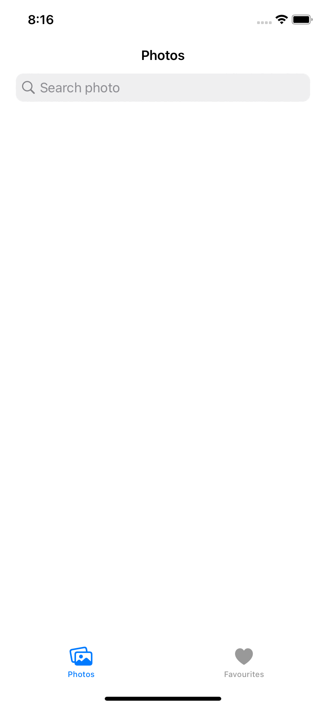
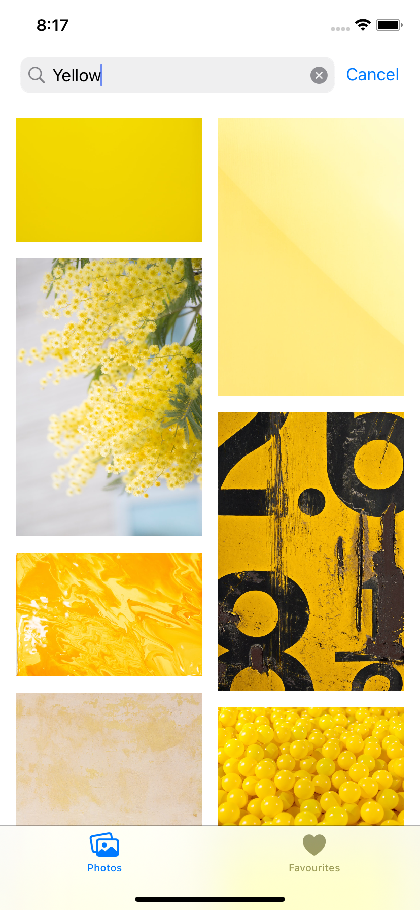
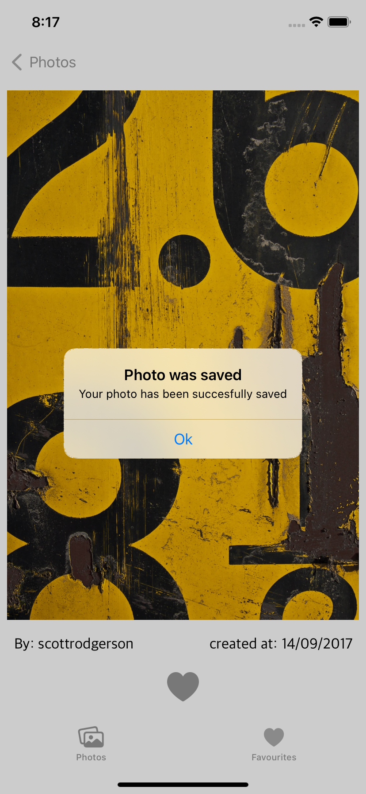
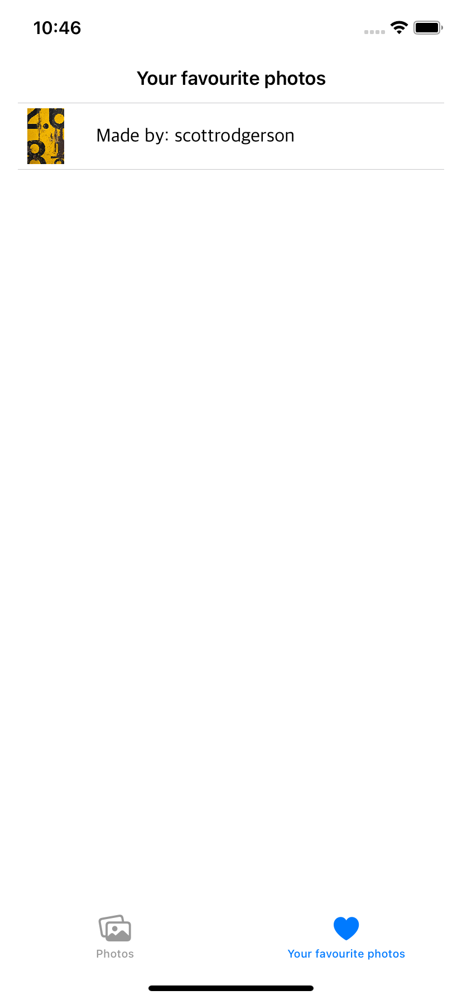

# TestPhotoApp
Данное приложение позволяет загружать фотографии из библиотеки бесплатных фото под названием Unsplash и сохранять понравившиеся.

_____

## В приложении были применены следующие технологии:
- MVC
- Realm
- SDWebImage
- URLSession
- UI сверстан с помощью NSAutoLayoutAnchor
____

     

    

